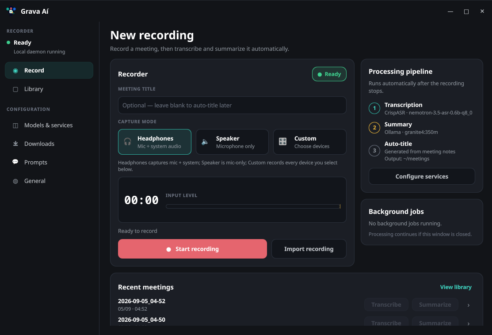

# GravaAI

Record your meetings, get your notes done.

GravaAI is a Linux desktop app that records a meeting's audio, transcribes it,
and turns it into structured Markdown notes — minutes, decisions, action items
and follow-ups — so you can stay in the conversation instead of taking notes.

It works with any OpenAI-compatible API, with local engines that run entirely
on your machine (whisper.cpp for transcription, Ollama for summarization), or
any mix of the two. Choose cloud for convenience, local for privacy — nothing
is locked in.

<p align="center">
  
</p>

## Features

- **Record the whole conversation** — capture your microphone and system audio
  at the same time (calls, browser audio, presentations), or pick exactly which
  devices to record. Each channel is loudness-normalized during capture, so a
  quiet microphone still lands at a healthy level.
- **Transcribe your way** — any OpenAI-compatible endpoint, or locally with
  whisper.cpp (timestamped transcript). An experimental CrispASR backend
  (Nemotron 3.5 ASR) is also available.
- **Notes that read like a secretary wrote them** — summarization turns the
  transcript into structured Markdown notes, and every meeting gets a title
  automatically when you don't name it.
- **A real meeting library** — browse past recordings and re-run transcribe or
  summarize on any of them at any time, without re-recording.
- **Pick your engines independently** — transcribe with one service and
  summarize with another. Mix cloud and local freely; local-only runs fully
  offline with no API key.
- **Lives in your tray** — the app starts tray-only, keeps recording and
  processing while the window is closed, and reopens instantly. A small
  recording pill shows elapsed time, live input level and pause/stop controls
  while you record (optional).
- **Never lose work** — background jobs keep processing if the window is
  closed, and interrupted jobs come back with a Retry button after a crash.
- **Call detection** — optionally watch for active calls and get notified when
  it's time to hit record.
- **Local engines without the hassle** — whisper.cpp, CrispASR and Ollama are
  downloaded as prebuilt, checksum-verified binaries from Settings → Models.
  No compiler, no system packages, no terminal.

## How it works

1. Pick a capture mode — headphones (mic + system audio), speaker (mic only),
   or a custom device selection — and press **Start recording**.
2. Pause and resume as needed; only the recorded parts are kept.
3. Press **Stop**. Transcription and summarization start automatically and run
   in the background — even if you close the window.
4. Find the results in your meetings folder:

```
~/meetings/
└── 2026/
    └── March/
        └── 04/
            └── 14-30_Standup/
                ├── recording.mp3
                ├── transcript.md
                └── notes.md
```

## Installation

Download `gravaai-<version>-<arch>.AppImage` from the
[Releases](../../releases) page, make it executable, and run it — that single
file is the whole app:

```bash
chmod +x gravaai-*-x86_64.AppImage
./gravaai-*-x86_64.AppImage
```

The AppImage bundles FFmpeg, Qt and everything else the app needs, so there is
nothing else to install. Optionally move it somewhere on your `PATH` (e.g.
`~/.local/bin/`) or use [AppImageLauncher](https://github.com/TheAssassin/AppImageLauncher)
so it shows up in your application menu.

**Requirements:** Linux (x86_64 or arm64) with a graphical session, an audio
server (PipeWire/PulseAudio) and a system tray. [GNOME needs the
AppIndicator/KStatusNotifierItem extension](#gnome-notes) for the tray icon.

**Local engines** (whisper.cpp, CrispASR, Ollama and model weights) are not in
the base download — you install exactly what you want, when you want it, from
**Settings → Models**. Nothing runs or downloads until you choose it.

To uninstall, remove the AppImage file and run:

```bash
./gravaai-*.AppImage --uninstall
```

This removes desktop entries, icons, autostart, downloaded engines and models,
logs, config and the stored API key. **Your recordings are kept.**

## Choosing your services

Open **Models & services** in the app to pick and configure each stage. The
Status card there shows what's installed and running, and the Downloads tab
lists every file the app has downloaded with its location and size.

### Transcription

| Service | Runs | Notes |
|---|---|---|
| **OpenAI-compatible** | Cloud | Any `/v1`-style endpoint: OpenAI, Azure OpenAI, LiteLLM, llama.cpp server, … |
| **whisper.cpp** *(default)* | Local | Official prebuilt CPU binary + GGML models from HuggingFace |
| **CrispASR** *(experimental)* | Local | Prebuilt binary with Nemotron 3.5 ASR; CPU, Vulkan or CUDA |

### Summarization

| Service | Runs | Notes |
|---|---|---|
| **OpenAI-compatible** | Cloud | Any `/chat/completions`-style endpoint |
| **Ollama** | Local | Installing Ollama from the app starts the server for you |

Your API key is stored in the system keyring (GNOME Keyring / KWallet) when
one is available, falling back to a permission-restricted config file
otherwise.

## Recording modes

| Mode | What is captured | When to use |
|------|-----------------|-------------|
| **Headphones** | Microphone + system audio | You're wearing headphones — no echo risk |
| **Speaker** | Microphone only | Laptop speakers — avoids loopback echo |
| **Custom** | Every audio device you select | Multiple microphones or non-standard setups |

## Settings overview

- **General** — output folder (default `~/meetings`), recording quality,
  auto-process on stop, call detection, start at login, low-memory mode,
  recording pill on/off.
- **Models & services** — pick the transcription and summarization services,
  install local engines, download models.
- **Prompts** — customize the transcription, summarization and title prompts;
  sensible defaults are built in and one click restores them.
- **Downloads** — everything the app downloaded, with paths and sizes.

When **Auto-process recordings** is on (default), stopping a recording starts
transcription and summarization automatically. Turn it off to only save the
audio and process manually from the Recorder dashboard or the Library.

## GNOME notes

GNOME has no built-in tray support, so the icon needs the
AppIndicator/KStatusNotifierItem extension: install your distro's package
(e.g. on Arch `sudo pacman -S gnome-shell-extension-appindicator`), enable it
in the GNOME Extensions app and log out/in. Whether left-click focuses the
window or opens the menu is decided by the tray host — KDE Plasma focuses the
window, the GNOME extension typically opens the menu. XFCE, MATE, Cinnamon,
KDE and LXQt show the icon natively.

## Tips

### Microphone picks up too much noise?

If your microphone captures a lot of ambient noise, PipeWire's WebRTC echo
cancellation can help. Load it for the current session:

```bash
pactl load-module module-echo-cancel aec_method=webrtc noise_suppression=true
```

To make it permanent, create `~/.config/pipewire/pipewire-pulse.conf.d/echo-cancel.conf`:

```
pulse.cmd = [
  { cmd = "load-module" args = "module-echo-cancel aec_method=webrtc noise_suppression=true" flags = [] }
]
```

Then restart PipeWire:

```bash
systemctl --user restart pipewire pipewire-pulse
```

### Where are the logs?

`/var/log/gravaai/` (fallback: `~/.local/share/gravaai/`), in `app.log`
(debug + info) and `error.log` (warnings and errors).

## Building from source (developers)

Regular installs never compile anything. To hack on GravaAI you need the Rust
toolchain, Qt 6 development packages (`qt6-base-dev`, `qt6-declarative-dev`,
`qt6-tools-dev-tools`, `qt6-svg-dev` on Ubuntu) and `ffmpeg`/`pactl`:

```bash
git clone https://github.com/jmarceno/gravaai
cd gravaai
cargo build --manifest-path linux/Cargo.toml --no-default-features --bin gravaai
cargo build --manifest-path linux/Cargo.toml --features ui --bin gravaai-ui
./linux/target/debug/gravaai

# Pack a local AppImage:
./linux/packaging/appimage/build-appimage.sh
```

## License

MIT
