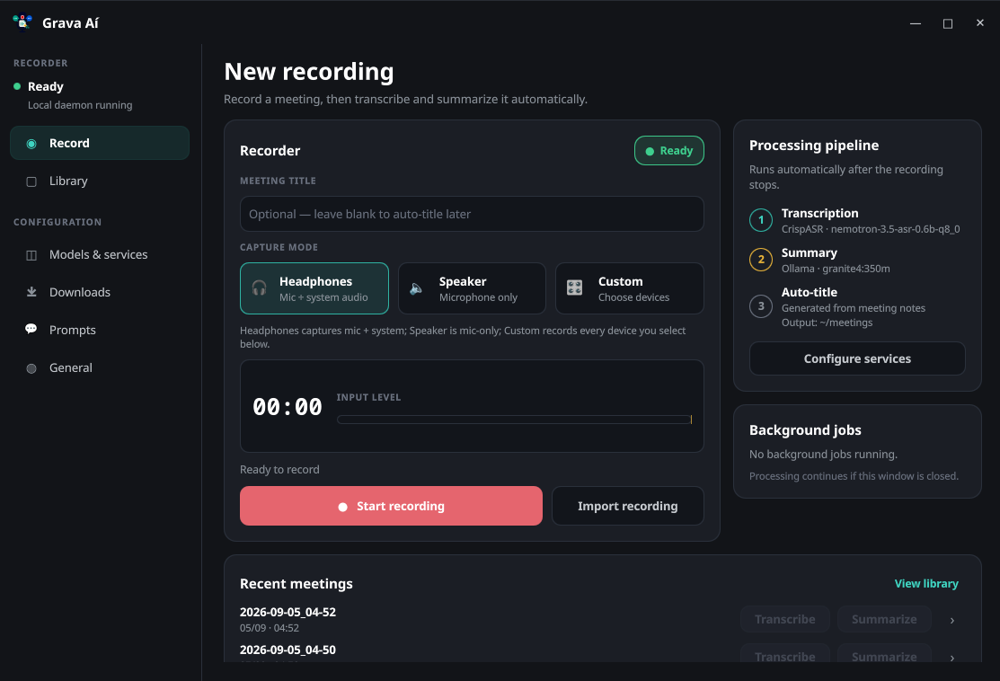

<p align="center">
  
</p>

<h1 align="center">GravaAi</h1>

<p align="center">
  <strong>Stay in the conversation. Keep the notes.</strong><br />
  Record meeting audio, turn it into a transcript, and leave with structured notes.<br />
  A Linux desktop app with your choice of local AI, cloud services, or both.
</p>

<p align="center">
  <a href="https://github.com/jmarceno/gravaai/releases">Get GravaAi</a> ·
  <a href="#why-gravaai">Why GravaAi</a> ·
  <a href="#quick-start">Quick start</a> ·
  <a href="#choosing-your-services">AI services</a> ·
  <a href="#recording-modes">Recording modes</a> ·
  <a href="#tips">Help</a>
</p>

<p align="center">
  <a href="LICENSE"></a>
  
  
</p>

<p align="center">
  
</p>

---

## Why GravaAi

For standups, interviews, lectures, and calls worth remembering: capture the
audio once, then come back to the transcript, decisions, and next steps.

| What you need | What GravaAi gives you |
| --- | --- |
| **Both sides of the call** | Record microphone and system audio together, microphone only, or a custom set of devices. Each channel is loudness-normalized during capture. |
| **Notes you can act on** | Summaries, key points, decisions, action items with owners, and open questions in Markdown. Notes follow the detected meeting language; untitled meetings get an automatic title. |
| **Control over your AI** | Choose transcription and summarization independently. Use whisper.cpp and Ollama locally, an OpenAI-compatible service, or a mix. |
| **A library you can revisit** | Browse recordings, import existing audio, and transcribe or summarize again without recording another meeting. |
| **A desktop app that stays out of the way** | Start from the tray, close the window while work continues, and use an optional floating recording pill with timer, input level, pause, and stop. |

Local whisper.cpp transcription adds timestamps, detects the spoken language,
and labels **Me** / **Remote** when microphone and system audio are captured
separately. Experimental **CrispASR** transcription is also available for
English. Speaker labels reflect the two audio channels, not individual people
in a group call.

Background jobs continue when the window closes. After a crash, interrupted
jobs return with a **Retry** button. Optional call detection can notify you
when a call starts.

### Your audio, your choice

With local transcription and local summarization, processing runs on your
machine without an API key or an internet connection once engines and models
are downloaded. Choosing a cloud service sends the input for that stage to
your configured endpoint. Recordings, transcripts, and notes live in ordinary
files you can open with your own tools.

## How it works

1. Pick a capture mode — headphones (mic + system audio), speaker (mic only),
   or a custom device selection — and press **Start recording**.
2. Pause and resume as needed; only the recorded parts are kept.
3. Press **Stop**. Transcription and summarization start automatically and run
   in the background — even if you close the window.
4. Find the results in your meetings folder:

```
~/meetings/
└── 2026-03-04_14-30_Standup/
    ├── recording.mp3
    ├── transcript.md
    ├── notes.md
    └── meeting.json
```

You can also **Import** an existing audio file from the Recorder page: it is
copied into a new meeting folder and processed like a recording.

## Quick start

Download `GravaAi-<version>-<arch>-portable.run` from the
[Releases](https://github.com/jmarceno/gravaai/releases) page. This single file contains both executables,
Qt/QML, audio helpers and their shared-library dependencies:

```bash
chmod +x GravaAi-*-x86_64-portable.run
./GravaAi-*-x86_64-portable.run install
./GravaAi-*-x86_64-portable.run
```

`install` writes the menu entry pointing at the stable launcher. Keep the file
at that location; `install --autostart` also enables login startup. Maintainers
can use `./scripts/install.sh` to atomically install the latest bundle at
`~/.local/bin/gravaai`. Existing config, API keys, model installs and recordings
are preserved. Reinstall refreshes the menu and any enabled login entry.

The release container uses Ubuntu 22.04 (glibc 2.35). The daemon and Rust dependencies are
statically linked (musl); Qt and its plugins stay dynamically linked and are bundled
with their full library closure, plus fallback fonts for minimal environments.
No system packages or compilation are needed
for the bundled app. Rendering defaults to software; an explicit
`QT_QUICK_BACKEND` or `QSG_RHI_BACKEND` overrides it.

**Requirements:** Linux (x86_64 or arm64), glibc 2.35 or newer, a graphical session, an audio
server (PipeWire/PulseAudio) and a system tray. [GNOME needs the
AppIndicator/KStatusNotifierItem extension](#gnome-notes) for the tray icon.

**Local engines** (whisper.cpp, CrispASR, Ollama and model weights) are not in
the base download — you install exactly what you want, when you want it, from
**Models & services**. Nothing runs or downloads until you choose it.

On the first run, open GravaAi from its tray icon, visit **Models & services**,
and make both processing stages ready. The default transcription service is
whisper.cpp; choose Ollama for local notes or configure an OpenAI-compatible
endpoint for cloud notes. Then return to **Record** and start your meeting.

To uninstall, run:

```bash
./GravaAi-*-portable.run --uninstall
```

This removes desktop entries, icons, autostart, downloaded engines and models,
logs, config and the stored API key. **Your recordings are kept.**

## Choosing your services

Open **Models & services** in the app to pick and configure each stage. Every
step a job needs (engine, model, server) is listed with whether it is ready and
a one-click Install/Download button; changes save automatically. The Downloads
page lists every file the app has downloaded with its location and size.

Local engines arrive as prebuilt downloads, with no compiler or system-package
installation. whisper.cpp and Ollama engine archives are checksum-verified;
experimental CrispASR engine downloads do not yet have pinned checksums.

### Transcription

| Service | Runs | Notes |
|---|---|---|
| **OpenAI-compatible** | Your endpoint | A service exposing the OpenAI-style `/audio/transcriptions` API |
| **whisper.cpp** *(default)* | Local | Official prebuilt CPU binary + GGML models from HuggingFace; detects the spoken language |
| **CrispASR** *(experimental)* | Local | Prebuilt binary with Nemotron 3.5 ASR; CPU, Vulkan or CUDA |

### Summarization

| Service | Runs | Notes |
|---|---|---|
| **OpenAI-compatible** | Your endpoint | A service exposing the OpenAI-style `/chat/completions` API |
| **Ollama** | Local | Installed with its GPU (CUDA) runtime; the app starts the server for you |

> Upgrading from an older version? If the Ollama row on Models & services says
> **Incomplete install**, press **Reinstall** — older versions installed Ollama
> without its GPU runtime, which made summaries run slowly on the CPU.

Your API key is stored in the system keyring (GNOME Keyring / KWallet) when
one is available, falling back to a permission-restricted config file
otherwise.

## Recording modes

| Mode | What is captured | When to use |
|------|-----------------|-------------|
| **Mic + system** | Microphone (left channel) + system audio (right channel) | You're wearing headphones — no echo risk; transcripts label "Me" vs "Remote" |
| **Mic only** | Microphone on the left; right channel silent | Laptop speakers — avoids loopback echo |
| **Custom** | Selected microphones on the left; system monitors on the right | Multiple microphones or non-standard setups |

Multiple Custom sources are mixed only within their own role. Microphone and
system channels stay separate through pause/resume and the stereo WAV sent to
Whisper. Whisper uses these channels to label "Me" and "Remote"; recognition
accuracy still depends on the audio and model.

## Settings overview

- **General** — output folder (default `~/meetings`), recording quality,
  auto-process on stop, call detection, start at login, low-memory mode,
  recording pill on/off. All settings save as soon as you change them.
- **Models & services** — pick the transcription and summarization services,
  install local engines, download models.
- **Prompts** — customize the transcription, summarization and title prompts;
  sensible defaults are built in and one click restores them.
- **Downloads** — everything the app downloaded, with paths and sizes.

When **Auto-process recordings** is on (default), stopping a recording starts
transcription and summarization automatically. Turn it off to only save the
audio and process manually from the Recorder dashboard or the Library.

## GNOME notes

GNOME has no built-in tray support, so the icon needs the
AppIndicator/KStatusNotifierItem extension: install your distro's package
(e.g. on Arch `sudo pacman -S gnome-shell-extension-appindicator`), enable it
in the GNOME Extensions app and log out/in. Whether left-click focuses the
window or opens the menu is decided by the tray host — KDE Plasma focuses the
window, the GNOME extension typically opens the menu. XFCE, MATE, Cinnamon,
KDE and LXQt show the icon natively.

## Tips

### Microphone picks up too much noise?

If your microphone captures a lot of ambient noise, PipeWire's WebRTC echo
cancellation can help. Load it for the current session:

```bash
pactl load-module module-echo-cancel aec_method=webrtc noise_suppression=true
```

To make it permanent, create `~/.config/pipewire/pipewire-pulse.conf.d/echo-cancel.conf`:

```
pulse.cmd = [
  { cmd = "load-module" args = "module-echo-cancel aec_method=webrtc noise_suppression=true" flags = [] }
]
```

Then restart PipeWire:

```bash
systemctl --user restart pipewire pipewire-pulse
```

### Where are the logs?

`/var/log/gravaai/` (fallback: `~/.local/share/gravaai/`), in `app.log`
(debug + info) and `error.log` (warnings and errors).

## Building from source (developers)

Regular installs never compile anything. To hack on GravaAi you need the Rust
toolchain, Qt 6 development packages (`qt6-base-dev`, `qt6-declarative-dev`,
`qt6-tools-dev-tools`, `qt6-svg-dev` on Ubuntu) and `ffmpeg`/`pactl`:

```bash
git clone https://github.com/jmarceno/gravaai
cd gravaai
cargo build --release --manifest-path linux/Cargo.toml --no-default-features --bin gravaai
cargo build --release --manifest-path linux/Cargo.toml --features ui --bin gravaai-ui
./linux/target/release/gravaai

# Build and verify the portable release:
./scripts/build-portable.sh --container
./scripts/smoke-portable.sh build/portable/*-portable.run
./scripts/install.sh
```

## License

GravaAi is released under the [MIT license](LICENSE).

Have an idea or found a bug? [Open an issue](https://github.com/jmarceno/gravaai/issues)
with what happened and the relevant logs. If GravaAi makes your meetings
easier, a star helps other Linux users discover it.
